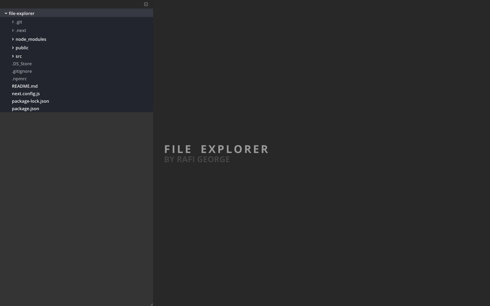

# (DEMO APP) File Explorer

Powered by [Next.js](https://nextjs.org/) (A NodeJs and React framework) and [Socket.IO](https://socket.io/), this file explorer allows you to view file trees on your system in an elegant way.



## Features

- An elegant tree view of directories and nested contents
- Expandable/collapsable sections so you focus on what matters most
- Changes to files and directories made on the host machine (such as addition, rename, removal and deletion) are reflected
- Collapse all sections and start over with a single click
- Tree view is expandable (click and drag and the handle on the bottom right corner of that panel)


## How It Works
1. Server runs and initializes websockets through Socket.IO
2. Client app (UI) creates a socket connection with the server and then requests a list of initial directories to display
3. First directory on the list is expanded automatically. When any directory is expanded, two requests are made:
  - To retrieve a list of contents immediately within that directory
  - To watch the directory and its immediate contents for any changes done outside of the application
4. Upon FileSystem events, the server and client communicate through sockets to perform updates. This avoids otherwise expensive polling operations.
5. When a directory is collapsed, a request to unwatch that directory is made.

## Try It!

### Prerequisite(s)
Minimum Node version required (v12.16.1). To upgrade your Node version, you may use [nvm](https://github.com/nvm-sh/nvm).

### 1- Clone and enter project folder
In a bash terminal, enter the following:
```sh
git clone https://github.com/RAFIHAYTHAM1996/file-explorer.git
cd file-explorer
```

### 2- Install and build
```sh
npm install
npm run build
```

### 3- Run
Enter one or more paths (absolute or relative) following **node src/server/index.js** to the directories you'd like to explore. Once you see `Ready on http://localhost:3000` in your terminal, open your browser at the given address to use the app
```sh
node src/server/index.js ./ ../
```

> Note: if you provide duplicate paths to a directory (such as ./ twice), it will only appear as one section in the tree view 

